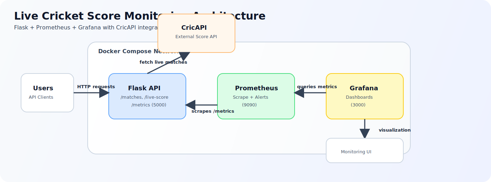
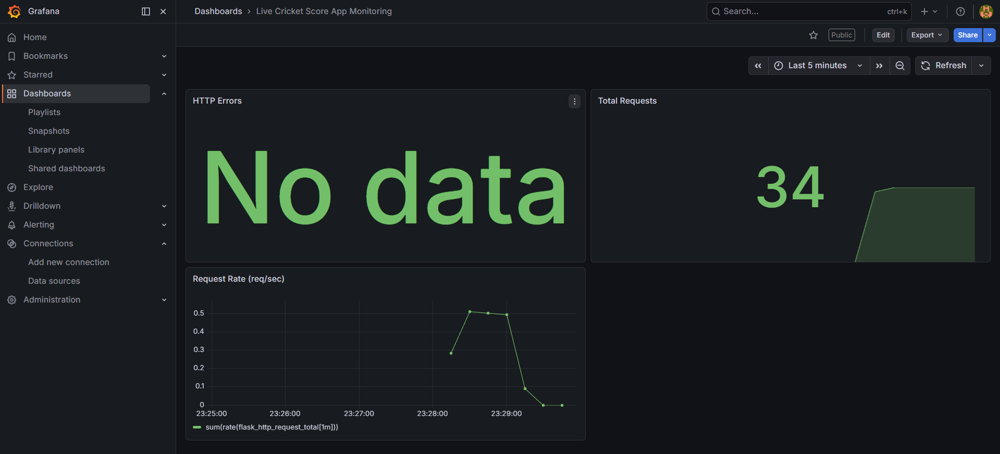
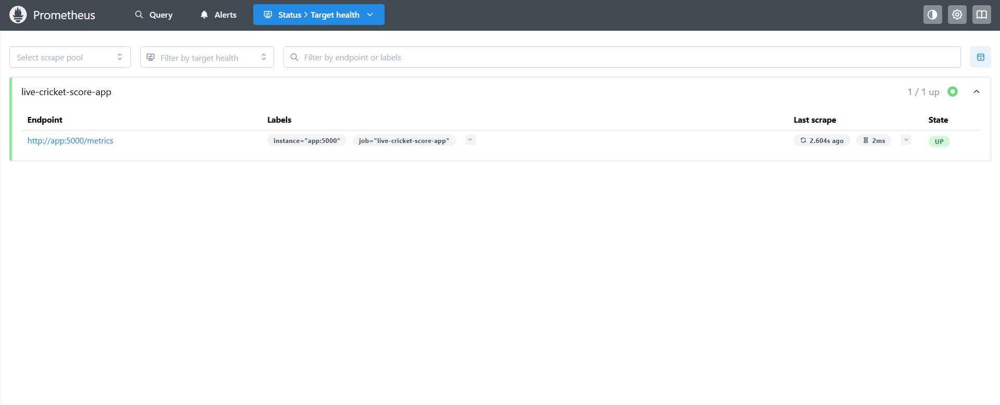
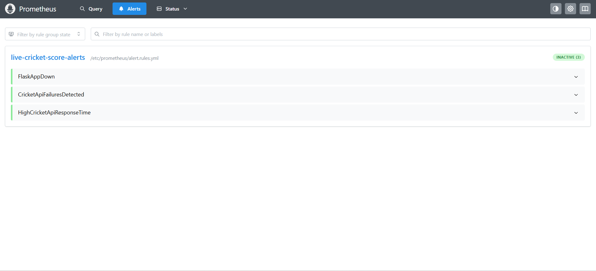
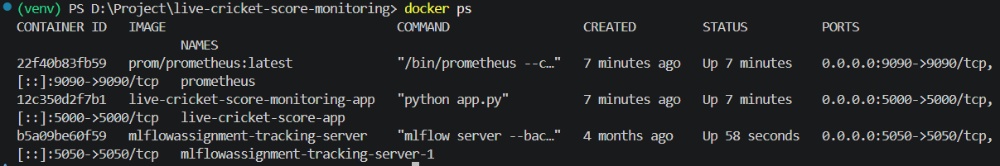

# Live Cricket Score Monitoring


A Dockerized Flask app that serves live cricket data from CricAPI, renders a rich web scoreboard UI, exposes Prometheus metrics, and ships with Prometheus + Grafana monitoring.

## Latest Updates

- Added a frontend scoreboard at `GET /` with search, match-type tabs (All/Live/Recent/Upcoming), and modal match details
- Added detailed endpoint `GET /match-details/<match_id>` with normalized scorecard, toss info, and metadata fallback handling
- Improved `/matches` feed with categorization (`live_matches`, `recent_matches`, `upcoming_matches`) and cache metadata
- Added resilient cache strategy with configurable TTLs and graceful fallback when CricAPI has temporary issues
- Enriched match summaries with venue timezone inference and per-team visual details
- Updated Docker setup so Grafana is exposed on host port `3001`

## Architecture



Flow summary: `Browser/UI -> Flask API -> CricAPI`, and `Flask metrics -> Prometheus -> Grafana`.

## Features

- Live and recent cricket match discovery from CricAPI
- Rich homepage UI with auto-refresh every 60 seconds
- Match details drawer with scorecard (batting/bowling tables where available)
- Cached API responses for better reliability and lower external API usage
- Prometheus instrumentation with custom cricket API counters/histograms
- Alert rules for service downtime, cricket API failures, and high response time
- Pre-provisioned Grafana datasource and dashboards

## Tech Stack

- Python 3.11
- Flask + Jinja template rendering
- Requests + python-dotenv
- prometheus_flask_exporter + prometheus_client
- Prometheus + PromQL
- Grafana OSS
- Docker + Docker Compose

## Project Structure

```text
live-cricket-score-monitoring/
|- app/
|  `- src/
|     |- app.py
|     `- templates/
|        `- index.html
|- monitoring/
|  |- prometheus/
|  |  |- prometheus.yml
|  |  `- alert.rules.yml
|  `- grafana/
|     |- dashboards/
|     |- provisioning/
|     `- data/
|- docs/
|  |- diagrams/
|  `- screenshots/
|- Dockerfile
|- docker-compose.yml
|- requirements.txt
`- README.md
```

## Prerequisites

- Docker Desktop (or Docker Engine + Compose plugin)
- Valid CricAPI API key

## Configuration

Create a `.env` file in the project root:

```env
CRICKET_API_KEY=your_api_key_here

# Optional cache tuning
MATCHES_CACHE_TTL_SECONDS=300
MATCH_INFO_CACHE_TTL_SECONDS=21600
MATCH_INFO_LIVE_CACHE_TTL_SECONDS=90
```

## Quick Start

1. Clone the repository.

```bash
git clone https://github.com/viditpawar/live-cricket-score-monitoring
cd live-cricket-score-monitoring
```

2. Add your `.env` file (see Configuration section).

3. Start everything.

```bash
docker compose up --build
```

4. Open services.

- App UI + API: http://localhost:5000
- Prometheus: http://localhost:9090
- Grafana: http://localhost:3001

Grafana first-login credentials are usually `admin` / `admin` (password change may be required).

## API Endpoints

- `GET /` renders the CricPulse scoreboard UI
- `GET /health` returns service health
- `GET /config-check` confirms whether `CRICKET_API_KEY` is loaded
- `GET /matches` returns categorized and enriched matches
- `GET /matches?refresh=1` bypasses cache and forces data refresh
- `GET /match-details/<match_id>` returns normalized scorecard + metadata for one match
- `GET /live-score` returns one live/current match
- `GET /live-score?match_name=india` filters live/current matches by name
- `GET /metrics` exposes Prometheus metrics

## `/matches` Response Highlights

- `total_matches`, `live_count`, `recent_count`, `upcoming_count`
- `matches`, `live_matches`, `recent_matches`, `upcoming_matches`
- `served_from_cache`, `cache_age_seconds`, `cache_ttl_seconds`
- `warning` when enrichment or upstream data is partially unavailable

## Metrics Collected

- `flask_http_request_total`
- `live_score_requests_total`
- `cricket_api_requests_total`
- `cricket_api_failures_total`
- `cricket_api_response_time_seconds`

## Alert Rules

- `FlaskAppDown`
- `CricketApiFailuresDetected`
- `HighCricketApiResponseTime`

## Grafana Setup

- Prometheus datasource is auto-provisioned from `monitoring/grafana/provisioning/datasources/datasource.yml`
- Dashboard provider is configured in `monitoring/grafana/provisioning/dashboards/dashboard.yml`
- Dashboard JSON: `monitoring/grafana/dashboards/Live Cricket Score App Monitoring-1776234168280.json`

If auto-load fails, import manually in Grafana:

`Dashboards -> New -> Import`

## Screenshots

### Grafana Dashboard



### Prometheus Targets



### Prometheus Alerts



### Docker Containers



## Future Improvements

- Add Alertmanager notifications (Slack/Email)
- Add Node Exporter/cAdvisor for host and container infrastructure metrics
- Add tests for match normalization and cache logic
- Deploy on Kubernetes
